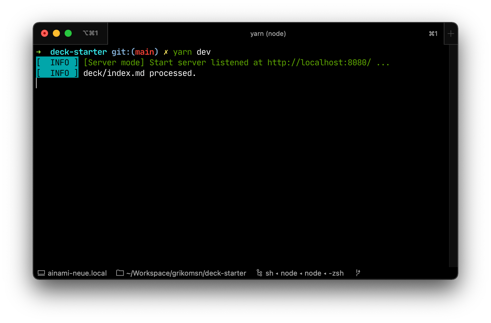
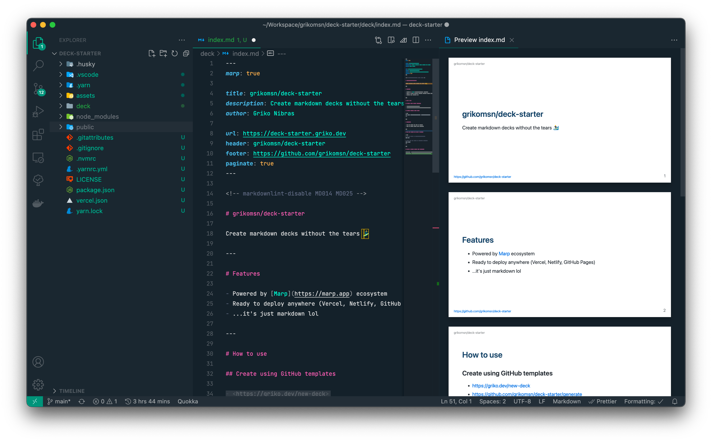

<!-- markdownlint-disable MD033 MD036 MD041 -->

# deck-starter

Create markdown decks without the tears 🏄‍♂️

---

**Table of contents**

- [Features](#features)
- [How to use](#how-to-use)
  - [Create using Vercel](#create-using-vercel)
  - [Create using GitHub templates](#create-using-github-templates)
  - [Create locally using degit](#create-locally-using-degit)
- [Workflows](#workflows)
  - [Run dev server and open in browser](#run-dev-server-and-open-in-browser)
  - [Edit in Visual Studio Code extension](#edit-in-visual-studio-code-extension)
- [Deployment](#deployment)
- [Suggestions and/or questions](#suggestions-andor-questions)
- [Maintainers](#maintainers)
- [License](#license)

---

## Features

- Powered by [Marp](https://marp.app) ecosystem ([Marp CLI](https://github.com/marp-team/marp-cli), [Marp Core](https://github.com/marp-team/marp-core), [Marpit](https://marpit.marp.app/))
- Ready to deploy anywhere (Vercel, Netlify, any static deployment)
- ...it's just markdown lol

## How to use

### Create using Vercel

[](https://vercel.com/new/clone?repository-url=https%3A%2F%2Fgithub.com%2Fgrikomsn%2Fdeck-starter)

Click the Vercel deploy button above to deploy and create a new deck-starter repository.

### Create using GitHub templates

[](https://griko.dev/new-deck)

Click the badge above the readme, or visit these links to create a new GitHub repository using this template:

- <https://griko.dev/new-deck>
- <https://github.com/grikomsn/deck-starter/generate>

### Create locally using degit

```sh
npx degit grikomsn/deck-starter [new-directory-name]
```

## Workflows

### Run dev server and open in browser

```sh
# run dev server on http://localhost:8080
yarn start

# build deck and export in "/public" directory
yarn build
```



### Edit in Visual Studio Code extension

- Extension: [Marp for VS Code](https://marketplace.visualstudio.com/items?itemName=marp-team.marp-vscode)
- Repository: [marp-team/marp-vscode](https://github.com/marp-team/marp-vscode)



## Deployment

TODO

## Suggestions and/or questions

[Submit an issue](https://github.com/grikomsn/deck-starter/issues) or [discuss on GitHub](https://github.com/grikomsn/deck-starter/discussions).

## Maintainers

- Griko Nibras ([@grikomsn](https://github.com/grikomsn))

## License

[MIT License, Copyright (c) 2021 Griko Nibras](./LICENSE)
